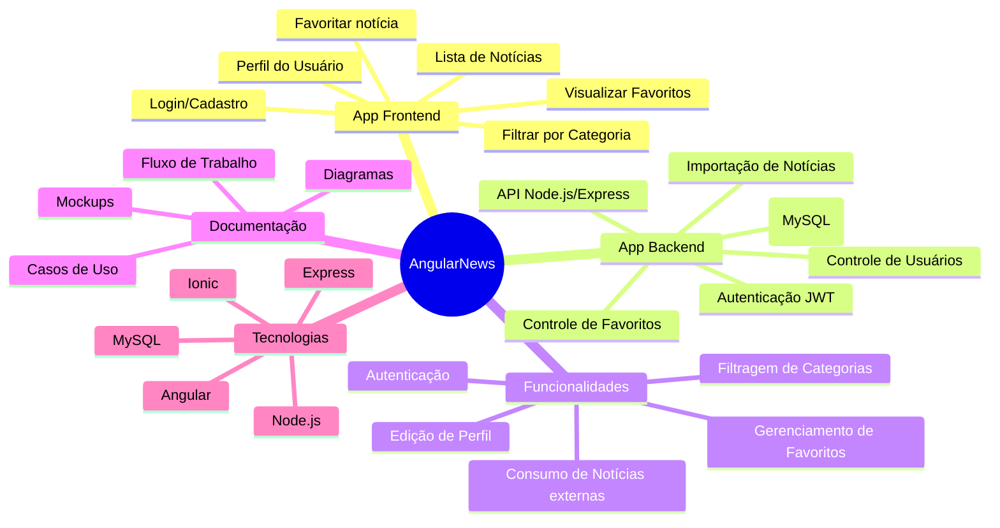

# AngularNews

## Visão Geral

O **AngularNews** é um Web App desenvolvido com Angular (Ionic Framework), focado em fornecer notícias personalizadas ao usuário. O sistema permite cadastro, autenticação, escolha de categorias, favoritos e consumo de notícias em tempo real via APIs públicas, oferecendo uma experiência fluida, responsiva e moderna.

---

## Índice

- [Visão Geral](#visão-geral)
- [Diagramas do Projeto](#diagramas-do-projeto)
- [Como baixar o repositório](#como-baixar-o-repositório)
- [Pré-requisitos](#pré-requisitos)
- [Estrutura de Pastas](#estrutura-de-pastas)
- [Contribuindo](#contribuindo)
- [Documentação](#documentação)
- [Autores](#autores)
- [Licença](#licença)

---

## Diagramas do Projeto

### 1. Mapa Mental do Sistema (Mindmap)



---

### 2. Diagrama de Classes

Veja também em: `angularnewsdocs/Models/classes/diagrama_classes.md`


---

### 3. Diagrama ER (Modelo de Banco de Dados)

Veja também em: `angularnewsdocs/Models/database/diagrama_bd.md`


---

## Como baixar o repositório

```bash
git clone https://github.com/SEU_USUARIO/AngularNews.git
cd AngularNews
```

---

## Pré-requisitos

- Node.js (>=18.x)
- Angular CLI (`npm install -g @angular/cli`)
- Ionic CLI (`npm install -g @ionic/cli`)
- MySQL (para o backend)
- (Opcional) Firebase CLI
- Conta no GitHub

---

## Estrutura de Pastas

```
AngularNews/
│
├── angularnewsapi/          # Projeto backend (Node.js/Express)
├── angularnewsapp/          # Projeto frontend (Angular/Ionic)
├── angularnewsdocs/         # Documentação
│   ├── Models/
│   │   ├── classes/         # Diagramas de classes
│   │   ├── database/        # Diagramas de banco de dados
│   │   ├── mindmap/         # Mapa mental do projeto
│   │   └── Mockup/          # Mockups e protótipos de tela
│   ├── Sql/                 # Scripts SQL e modelos de dados
│   └── UseCase/             # Casos de uso, fluxogramas, tutoriais, etc.
├── .gitignore
├── CONTRIBUTING.md
├── LICENSE
├── README.md
└── TODO.md
```

---

## Contribuindo

Para contribuir com o projeto, siga os passos abaixo ou consulte o arquivo [CONTRIBUTING.md](CONTRIBUTING.md):

1. Faça um fork do projeto;
2. Crie um branch para sua feature/correção:
    ```bash
    git checkout -b minha-feature
    ```
3. Faça suas alterações e commits:
    ```bash
    git add .
    git commit -m "Minha contribuição"
    ```
4. Envie seu branch:
    ```bash
    git push origin minha-feature
    ```
5. Abra um Pull Request no GitHub.

Mais detalhes e o fluxo completo estão disponíveis em [tutorial_fluxo_trabalho.pdf](angularnewsdocs/UseCase/tutorial_fluxo_trabalho.pdf).

---

## Documentação

- [Diagramas de Classes](angularnewsdocs/Models/classes/diagrama_classes.md)
- [Modelo de Banco de Dados](angularnewsdocs/Models/database/diagrama_bd.md)
- [Mapa Mental](angularnewsdocs/Models/mindmap/mindmap.md)
- [Casos de Uso](angularnewsdocs/UseCase/Casos_de_Uso_AngularNews.md)
- [Fluxograma de Trabalho](angularnewsdocs/UseCase/fluxo_trabalho.md)
- [Tutorial de Git e Ferramentas](angularnewsdocs/UseCase/tutorial_fluxo_trabalho.pdf)

---

## Autores

- [Seu Nome](https://github.com/SEU_USUARIO)
- [Colaboradores](#)

---

## Licença

Este projeto está licenciado sob a [Creative Commons BY 4.0](LICENSE).

---
